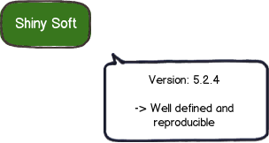

# DevOps 工具鉴宝之 Liquibase

了解 Liquibase 在数据库脚本版本管理实践中的作用、掌握基本的使用方法。

## 为什么数据库脚本需要纳入版本管理？

首先，让我们从头开始，假设我们有一个名为 ***Shiny*** 的项目，其主要交付项目是一个名为 ***Shiny Soft*** 的软件，该软件连接到名为 ***Shiny DB*** 的数据库。

可以简单描述此种情景的图可能看起来像这样：

现在，我们拥有我们的软件和数据库了。非常好。这很可能就是所有我们需要的东西了。

但是在大多数项目中，实际情况并不是这样子的，而是这样子的：

我们不只要处理一个环境，而是要处理**多个环境**。这提出了许多挑战。

**在代码层面，我们已经做得非常好了：**

- 代码的版本控制已普遍存在，甚至每天都可能发布更好的工具。
- 我们拥有可重复制作的版本和持续集成。
- 我们有明确定义的发布和部署流程。

**但是在数据库脚本管理层面呢？**

不幸的是，我们在此方面做得并不好。

许多项目仍然依赖手动应用的 `SQL` 脚本。有时甚至使用现场编写的 `SQL` 语句来解决问题。这会导致许多问题：

1. 该机器上的数据库当前处于什么状态？
2. 想要运行的脚本是否已经应用过了？
3. 生产中的快速修复脚本（现场编写的 `SQL` 语句等）是否已应用到测试环境中了？
4. 如何创建一个新的数据库实例？

这些问题的答案通常是：***我们不知道***。

**这个时候，我们怎么办呢？**

**数据库脚本的版本管理**就是回答这些问题的好方法。

数据库脚本版本化管理之后，我们应该可以做到：

1. 所有数据库脚本入库（代码仓库，如Github、Gitlab等）管理
2. 方便地从零开始创建新的数据库实例
3. 随时清楚数据库当前所处的状态
4. 确定性地从当前数据库版本迁移到新版本
5. 无需手工执行数据库脚本变更操作
6. 方便地回退数据库变更

## 纯脚本化的数据库脚本管理方案

## 通过 Liquibase 管理数据库脚本

### Liquibase 简介

这部分可以尽可能的短争取，5~10 分钟结束

### Liquibase 与 Flyway 的比较

简洁对比即可

### Liquibase 实战

这里是关键，可否演示一个完整场景，代码库里可以包含完整的命令行、操作流程；提供样例脚本和文件，帮助大家快速上手这个工具，提供在流水线里操作数据库变更/升级等流程。

总之所有讲解都是基于功能演示讲清楚这个技术，基于完整的演示流程讲清楚这个工具在 DevOps 流水线中的使用方式。