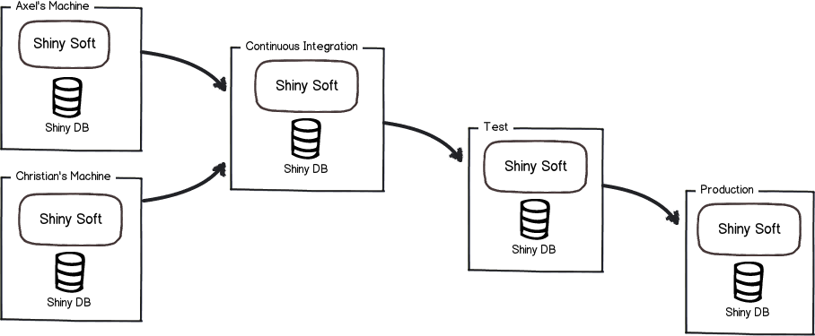
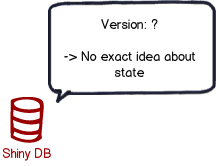

# DevOps 工具鉴宝之 Liquibase

了解 Liquibase 在数据库脚本版本管理实践中的作用、掌握基本的使用方法。

## 为什么数据库脚本需要纳入版本管理？

首先，让我们从头开始，假设我们有一个名为 ***Shiny*** 的项目，其主要交付项目是一个名为 ***Shiny Soft*** 的软件，该软件连接到名为 ***Shiny DB*** 的数据库。

可以简单描述此种情景的图可能看起来像这样：


现在，我们拥有我们的软件和数据库了。非常好。这很可能就是所有我们需要的东西了。

但是在大多数项目中，实际情况并不是这样子的，而是这样子的：



我们不只要处理一个环境，而是要处理**多个环境**。这提出了许多挑战。

**在代码层面，我们已经做得非常好了：**

- 代码的版本控制已普遍存在，甚至每天都可能发布更好的工具。
- 我们拥有可重复制作的版本和持续集成。
- 我们有明确定义的发布和部署流程。


**但是在数据库脚本管理层面呢？**



不幸的是，我们在此方面做得并不好。

许多项目仍然依赖手动应用的 `SQL` 脚本。有时甚至使用现场编写的 `SQL` 语句来解决问题。这会导致许多问题：

1. 该机器上的数据库当前处于什么状态？
2. 想要运行的脚本是否已经应用过了？
3. 生产中的快速修复脚本（现场编写的 `SQL` 语句等）是否已应用到测试环境中了？
4. 如何创建一个新的数据库实例？

这些问题的答案通常是：***我们不知道***。

**这个时候，我们怎么办呢？**

**数据库脚本的版本管理**就是回答这些问题的好方法。

数据库脚本版本化管理之后，我们应该可以做到：

1. 所有数据库脚本入库（代码仓库，如Github、Gitlab等）管理
2. 方便地从零开始创建新的数据库实例
3. 随时清楚数据库当前所处的状态
4. 确定性地从当前数据库版本迁移到新版本
5. 无需手工执行数据库脚本变更操作
6. 方便地回退数据库变更

## 纯脚本化的数据库脚本管理方案

在介绍本次分享的主角之前，我们先循序渐进地来看看纯脚本化的管理方案。

本套方案遵循的两大原则：

1. 数据库变更应该有迹可循，即在代码仓库体现所有的变更，
2. 也应该可以使用变更脚本快速还原与生产基本一致的数据库

本着上述原则，参照平时的工作经验，设计出如下数据库变更方案，供大家参考。

脚本示例可参见：[db-script-templates](https://github.com/soul-craft/db-script-templates) 。

数据库脚本目录结构如下：

- `incremental_scripts`，文件夹，存储增量的`ddl`及`dml`变更脚本。
    - `ddl`文件夹，存储增量的`ddl`变更脚本。
    - `dml`文件夹，存储增量的`dml`变更脚本。
    - `entry_scripts`文件夹，存储增量的引导变更脚本。
- `initial_scripts`，文件夹，存储初始化数据库的`ddl`及`dml`变更脚本。
    - `ddl`文件夹，存储初始化数据库的`ddl`变更脚本。
        - `functions`文件夹，存储初始化数据库的创建函数变更脚本。
        - `stored_procedures`文件夹，存储初始化数据库的创建存储过程变更脚本。
        - `tables`文件夹，存储初始化数据库的创建表变更脚本。
        - `triggers`文件夹，存储初始化数据库的创建触发器变更脚本。
        - `views`文件夹，存储初始化数据库的创建视图变更脚本。
    - `dml`文件夹，存储初始化数据库的`dml`变更脚本。
- `db_setup_all.sql`，全量建库脚本。
- `db_setup_inc.sql`，增量变更脚本。
- `db_backup_inc.sh`，增量备份脚本。
- `db_rollback_inc.sh`，增量回退脚本。

### 如何快速创建数据库新实例

使用本方案管理数据库脚本后，可以按如下方法快速创建数据库新实例：

1. 切换到数据库脚本根目录，如：`db`

    ```Bash
    cd db
    ```

2. 打开 MySQL 命令行工具，登录到 root 用户

    ```Bash
    mysql -uroot -p
    ```

3. 在 MySQL 工具中设置编码，可根据项目实际情况设置相应的编码

    ```SQL
    set names utf8mb4;
    ```

4. 在 MySQL 工具中执行 `db_setup_all.sql`

    ```SQL
    source db_setup_all.sql;
    ```

### 方案分析

本方案可解决前文描述的四个问题中的第4个问题，可以快速从零开始创建一个新数据库实例，且与生产保持基本一致（生产环境中系统运行时新增的数据除外）。

- [ ] 该机器上的数据库当前处于什么状态？
- [ ] 想要运行的脚本是否已经应用过了？
- [ ] 生产中的快速修复脚本（现场编写的 `SQL` 语句等）是否已应用到测试环境中了？
- [x] 如何创建一个新的数据库实例？

如下要求也实现了其中的1、2、5、6条。

- [x] 所有数据库脚本入库（代码仓库，如Github、Gitlab等）管理
- [x] 方便地从零开始创建新的数据库实例
- [ ] 随时清楚数据库当前所处的状态
- [ ] 确定性地从当前数据库版本迁移到新版本
- [x] 无需手工执行数据库脚本变更操作
- [x] 方便地回退数据库变更

但是还无法做到可以清楚地知道当前数据库所处的状态，也就无法确定性地完成数据库版本迁移。

## 通过 Liquibase 管理数据库脚本

### Liquibase 简介

Liquibase 是一种数据库模式变更管理解决方案，它让你能够更快、更安全地在各个环境（从开发到生产）修改和发布数据库变更。

为简单起见，你可以直接使用 SQL 编写迁移脚本。也可以使用与数据库无关的方式，即在 XML、JSON 或 YAML 文件中编写你的变更内容，这样可以实现与特定数据库的解绑。

Liquibase 使用 SQL、XML、JSON 或 YAML
格式的变更日志（ [changelog](https://docs.liquibase.com/concepts/changelogs/working-with-changelogs.html)
）文件按顺序列出数据库变更（ [changesets](https://docs.liquibase.com/concepts/changelogs/changelog-formats.html)
）。数据库变更包含变更类型（ [Change Type](https://docs.liquibase.com/change-types/home.html)
），这是应用于数据库的操作类型，例如添加列或主键、插入、删除等等。


Liquibase 支持 6 种基本类型的命令：update、rollback、snapshot、diff、status 以及 utility。当你使用 update 命令部署你的第一个变更时，Liquibase
会检查数据库连接信息，包括用户信息、数据库 URL 和 JDBC 驱动程序等，这些信息存储在 liquibase.properties 配置文件中。

当你第一次部署变更时，Liquibase
会在你的数据库中创建两张表：[DATABASECHANGELOG](https://docs.liquibase.com/concepts/tracking-tables/databasechangelog-table.html)
和 [DATABASECHANGELOGLOCK](https://docs.liquibase.com/concepts/tracking-tables/databasechangeloglock-table.html) 。

DATABASECHANGELOG 表跟踪已部署的变更。 Liquibase 会将变更日志文件中的变更集与 DATABASECHANGELOG 跟踪表进行比较，仅部署新的变更集。

DATABASECHANGELOGLOCK 可以防止多个 Liquibase 实例同时更新数据库，确保只有一个 Liquibase 实例正在更新数据库。

Liquibase 提供了多种管理数据库变更的方法：

- 运行[命令行客户端](https://docs.liquibase.com/commands/working-with-command-parameters.html) (CLI)。

- 使用 [Liquibase Java API](https://www.liquibase.org/javadoc/) 并将 Liquibase 集成到你的应用程序中。

- 使用 [Maven](https://docs.liquibase.com/tools-integrations/maven/home.html)
  、 [Spring Boot](https://docs.liquibase.com/tools-integrations/springboot/home.html)
  、 [Ant](https://docs.liquibase.com/tools-integrations/ant/home.html)
  、 [Jenkins](https://docs.liquibase.com/workflows/liquibase-community/using-the-jenkins-pipeline-stage-with-spinnaker.html)
  、 [GitHub Actions](https://docs.liquibase.com/workflows/liquibase-community/setup-github-actions-workflow.html)
  或其他 CI/CD 工具将 Liquibase 集成到你的构建过程中。

- 以 [Docker](https://docs.liquibase.com/workflows/liquibase-community/using-liquibase-and-docker.html) 容器的方式使用。

### Liquibase 与 Flyway 的比较

简洁对比即可

### Liquibase 实战

这里是关键，可否演示一个完整场景，代码库里可以包含完整的命令行、操作流程；提供样例脚本和文件，帮助大家快速上手这个工具，提供在流水线里操作数据库变更/升级等流程。

总之所有讲解都是基于功能演示讲清楚这个技术，基于完整的演示流程讲清楚这个工具在 DevOps 流水线中的使用方式。

### Liquibase 方案思考

## 参考资料

- Liquibase 官网: https://www.liquibase.org/
- Flyway 官网: https://flywaydb.org/
- 纯脚本化管理方案示例代码: https://github.com/soul-craft/db-script-templates
- Liquibase 管理方案示例代码: https://github.com/soul-craft/liquibase-db-templates
